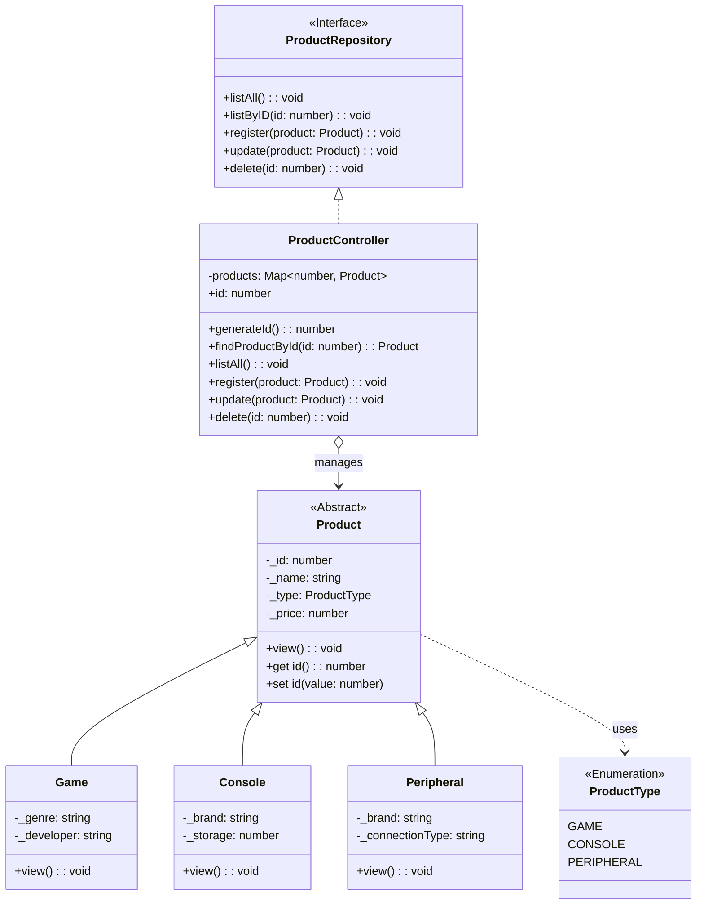

# Loja de Games

> Implementação de sistema de gerenciamento de estoque com foco em performance, integridade de dados e arquitetura em camadas.

<div align="center">
  
  
  
</div>

---

## Sobre o Projeto

O **Sistema de E-Commerce** é uma aplicação backend desenvolvida em **TypeScript** que simula o funcionamento logístico de uma loja de games.

Este projeto representa uma evolução na aplicação dos conceitos de **Programação Orientada a Objetos (POO)**. Além da estrutura padrão de camadas, o sistema foca em **performance de busca** (utilizando Estrutura de Dados `Map`), **resiliência** (tratamento de exceções no fluxo de entrada) e **integridade de dados** (validações rigorosas via encapsulamento).

## Funcionalidades e Diferenciais Técnicos

A aplicação gerencia um catálogo complexo de produtos tecnológicos através de um CLI (Command Line Interface) robusto.

| Funcionalidade | Status | Diferencial Técnico Aplicado |
| :--- | :---: | :--- |
| **Alta Performance** | ✅ | Uso de `Map<number, Product>` para buscas de complexidade **O(1)** (acesso imediato), superior a listas comuns. |
| **Categorização** | ✅ | Implementação de **3 Classes Estendidas** (Game, Console, Periférico) com atributos específicos. |
| **Integridade** | ✅ | **Setters com Validação**: O sistema impede nativamente preços negativos ou strings vazias lançando exceções. |
| **Resiliência** | ✅ | **Tratamento de Erros**: Uso de `try-catch` no Menu para impedir o fechamento abrupto (crash) da aplicação. |
| **Compatibilidade** | ✅ | Classe `Input` personalizada para corrigir problemas de codificação (UTF-8/CP850) em terminais Windows e Linux. |

## Arquitetura e Conceitos (POO & Clean Code)

O projeto foi desenhado para garantir que a Regra de Negócio estivesse protegida e separada da Interface de Usuário.

| Componente do Domínio | Regra de Negócio | Conceito Técnico Aplicado |
| :--- | :--- | :--- |
| **Produto (Base)** | Define o contrato base (ID, Nome, Preço). Não pode ser instanciado diretamente. | **Classe Abstrata** e Modificadores de Acesso (`protected/private`). |
| **Console / Game / Periférico** | Cada tipo possui dados únicos (ex: armazenamento para Console, gênero para Game). | **Herança** (`extends`) e **Polimorfismo** (Sobrescrita do método `view`). |
| **Tipagem Forte** | Categorias de produtos são pré-definidas para evitar erros de digitação. | **Enums** (`ProductType`). |
| **Controller** | Centraliza a lógica de armazenamento e busca. | Implementação de **Interface** (`implements Repository`). |
| **Camada de View** | Recebe dados e trata possíveis falhas de validação vindas do Model. | Estruturas de Controle de Fluxo e **Exception Handling**. |

## Diagrama de Classes e Relacionamentos
A arquitetura do domínio demonstra a aplicação prática dos pilares da Orientação a Objetos, destacando o polimorfismo através da classe abstrata Product, a especialização nas classes filhas e o desacoplamento via interface ProductRepository.


## Estrutura do Projeto

A organização segue o padrão MVC (Model-View-Controller) adaptado para persistência em memória:

```plaintext
┣ 📂 src
┃ ┣ 📂 controller      # Lógica de negócios e gestão da coleção (Map)
┃ ┣ 📂 model           # Classes de domínio (Produto e suas especializações)
┃ ┣ 📂 repository      # Interfaces (Contratos CRUD)
┃ ┗ 📂 util            # Utilitários (Cores, Formatação monetária, Input cross-platform)
┣ 📜 Menu.ts           # Ponto de entrada (Main) com loop de execução
┗ 📜 tsconfig.json     # Configuração do compilador TypeScript
```

## Impacto Técnico e Métricas

| Indicador Técnico | Descrição / Impacto no Projeto |
| :--- | :--- |
| **Complexidade Algorítmica** | **O(1) (Constante)** para busca e recuperação de dados, garantida pelo uso da estrutura de dados `Map`. |
| **Segurança de Tipos** | Eliminação de "Magic Numbers" e redução de bugs através do uso estrito de **Enums** e Tipagem Estática. |
| **Integridade de Dados** | Garantia de consistência através de encapsulamento: **Setters** validam dados e lançam exceções antes da persistência. |
| **Resiliência (Fail-safe)** | Arquitetura à prova de falhas: o uso de `try-catch` na camada de View impede que erros de input derrubem a aplicação. |
| **Arquitetura** | Separação clara de responsabilidades (SoC) entre Model, View e Controller, facilitando manutenção e testes. |

Como Executar

1. Clone o repositório:

```Bash
git clone [https://github.com/juliana-barreto/NOME-DO-REPO.git](https://github.com/juliana-barreto/NOME-DO-REPO.git)
```

2. Instale as dependências (incluindo readline-sync, colors e iconv-lite):

```Bash
npm install
```

3. Execute o projeto:

``` Bash
npm start
# ou
ts-node Menu.ts
```
